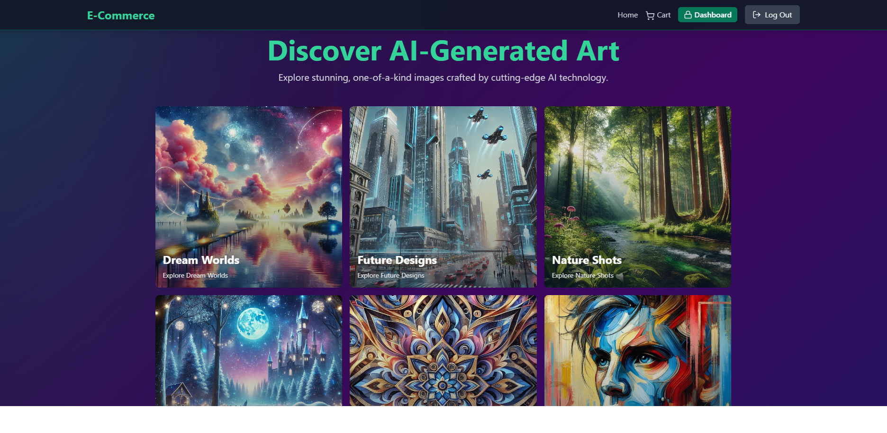

# AI-Generated Image Store 

## Overview

The **AI-Generated Image Store** is an e-commerce platform where users can explore and purchase AI-generated images. It features a Node.js backend, React frontend, and integrations for secure payments and efficient data handling.

---

## Features

- Browse and buy AI-generated artwork
- User-friendly interface with responsive design
- Secure payments via Stripe
- Image Storage with Cloudinary
- Admin tools for product and order management

---

## Build & Deploy

### Prerequisites
- **Node.js**, **npm**, **MongoDB**, **Redis**, and Stripe API keys

### Steps

#### Backend
1. Navigate to `backend/` and install dependencies:
   ```bash
   cd backend
   npm install

MONGODB_URI=<your-mongodb-uri>
REDIS_URL=<your-redis-url>
STRIPE_SECRET_KEY=<your-stripe-secret-key>

npm start

cd frontend
npm install

Update src/lib/axios.js with the backend URL.

npm run build

##Access
- Frontend: Your hosting URL
- Backend: Use Postman or the frontend to test endpoints.

##Technologies
- Backend: Node.js, Express.js, MongoDB, Redis, Stripe
- Frontend: React.js, Vite, TailwindCSS

## License
This project is licensed under the MIT License. See the [MIT License](LICENSE) file for more details.

## Notes
This project was developed as part of a coding bootcamp(Coding Factory) final project to demonstrate:
- The ability to customize and extend an existing codebase.
- The integration of custom designs and thematic updates.
