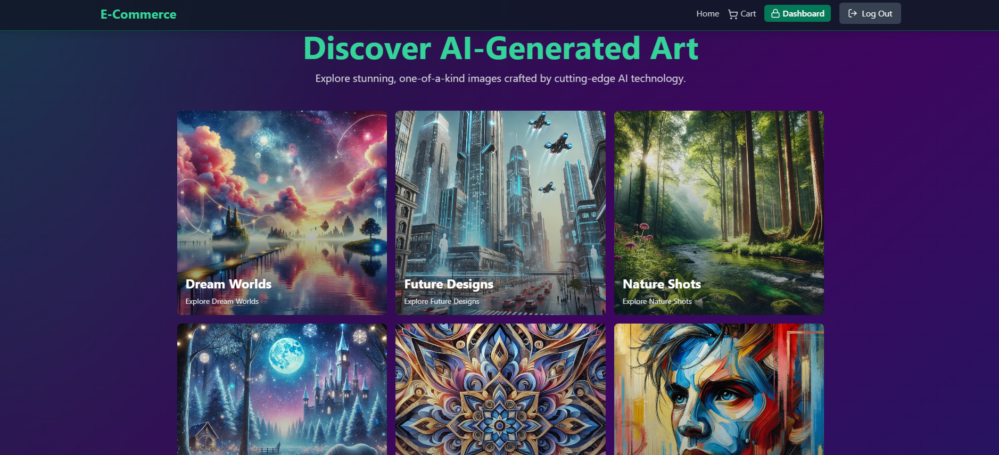

# AI-Generated Image Store 

## Overview

The **AI-Generated Image Store** is an e-commerce platform where users can explore and purchase AI-generated images. It features a Node.js backend, React frontend, and integrations for secure payments and efficient data handling.

## What This Project Does

**AI-Generated Image Store** is a complete e-commerce platform where users can browse and purchase AI-generated artwork.

### Simple Breakdown:

#### Backend (Server-side):
- **Controllers** handle different features:
  - `auth` - User login/signup
  - `product` - Managing artwork listings  
  - `cart` - Shopping cart functionality
  - `payment` - Processing purchases via Stripe
  - `coupon` - Discount codes
  - `analytics` - Store performance data

- **Models** - Database structure for users, products, orders, and coupons
- **Routes** - API endpoints connecting frontend to backend
- **Lib** - External services (Cloudinary for images, Stripe for payments, Redis for caching)

#### Frontend (User Interface):
- **Pages** - Different screens (Home, Login, Cart, Categories, Admin panel)
- **Components** - Reusable UI pieces (Product cards, Navigation, Cart items)
- **Public** - Sample AI artwork images

### In Simple Terms:
Think of it like **Etsy or Amazon, but specifically for AI-generated art**. Users can:
1. Browse AI artwork collections
2. Add items to their cart
3. Pay securely with Stripe
4. Admins can manage products and view sales analytics

This is a full-stack e-commerce solution built with modern web technologies, demonstrating complete end-to-end development skills from database design to user interface.

---

## Features

- Browse and buy AI-generated artwork
- User-friendly interface with responsive design
- Secure payments via Stripe
- Image Storage with Cloudinary
- Admin tools for product and order management

---

##Technologies
- Backend: Node.js, Express.js, MongoDB, Redis, Stripe
- Frontend: React.js, Vite, TailwindCSS

---

## Build & Deploy

### Prerequisites
- **Node.js**, **npm**, **MongoDB**, **Redis**, and Stripe API keys

### Steps

#### Backend
1. Navigate to `backend/` and install dependencies:
   ```bash
   cd backend
   npm install

- MONGODB_URI=<your-mongodb-uri>
- REDIS_URL=<your-redis-url>
- STRIPE_SECRET_KEY=<your-stripe-secret-key>

npm start

cd frontend
npm install

Update src/lib/axios.js with the backend URL.

npm run build

##Access
- Frontend: Your hosting URL
- Backend: Use Postman or the frontend to test endpoints.

---

## Notes
Learning Project: This project was developed as part of my Coding Factory bootcamp final project, following a tutorial while coding along from scratch.
- I customized the original concept by changing it to an AI-Generated Image Store theme, modifying colors, styling, and UI elements.
  
Educational Purpose: This repository demonstrates my ability to understand, implement, and customize full-stack applications using modern web technologies, serving as evidence of my learning journey and technical growth.

---

## License
This project is licensed under the MIT License. See the [MIT License](LICENSE) file for more details.


